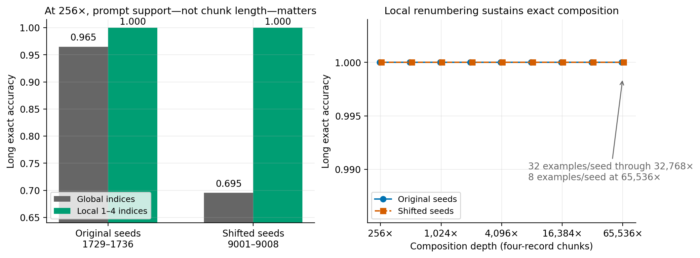
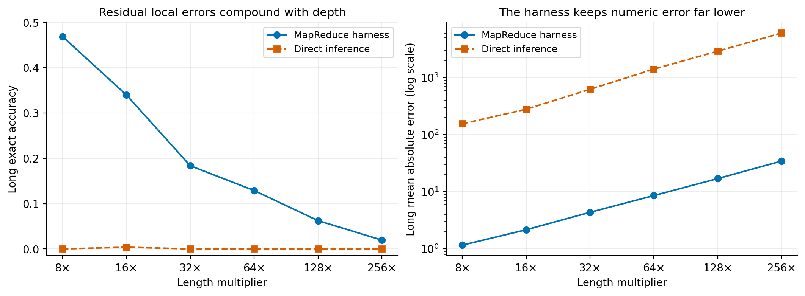

# Exact-support harnesses compose far beyond training length

**Reproduction verdict: partially reproduced**

This report evaluates the central claim of [*Language model harnesses are compositional generalizers*](https://arxiv.org/abs/2607.language-model-harnesses): a programmatic harness can reuse a learned short-context solver at much greater composition depth than direct inference. The evidence supports the mechanism strongly, but only under an important qualification: every decomposed prompt must remain inside the solver's complete training distribution, and the reducer must implement the task's correct algebra.

The publication package includes a [self-contained marimo notebook](notebook.py) and the exact terminal-run identifiers needed to trace each headline number.

## Executive summary

- A Qwen2.5-0.5B solver trained only on exactly four records stayed **100% exact across two independent eight-seed sets at 32,768× composition depth**—131,072 input records—after every chunk was locally renumbered to `record 1` through `record 4`.
- At 65,536× depth (262,144 records), both seed sets were again 100% exact in a reduced evaluation of eight long examples per seed (64 examples per seed set).
- Without local renumbering, the nominally identical four-record chunks retained global record indices absent from training. At 256× depth, exact accuracy fell from 1.000 to 0.9648 on the original seeds and to 0.6953 on shifted seeds.
- On a harder Qwen2.5-7B numeric-sum task with a nonzero local error rate, MapReduce exact accuracy declined from 0.4688 at 8× to 0.0195 at 256×. Even so, its 256× mean absolute error was 34.4 versus 6,019.3 for direct inference.
- Incorrect reduction, unseen chunk formats, and a task already handled by direct inference all remove or reverse the benefit. The result is therefore mechanistic rather than universal.

The campaign used Kubernetes with NVIDIA RTX PRO 6000 Blackwell GPUs, at most 16 GPUs concurrently. The queue runner verified 109 successful Kubernetes runs with terminal logs over 11.885146 hours of observed campaign wall time. Cancelled runs and terminal logs without measurement payloads are excluded from every claim below.

## What was tested

The reproduction isolates three components:

1. **A learned local solver.** A decoder-only language model is fine-tuned on short synthetic records and evaluated on held-out short examples.
2. **A programmatic harness.** Long inputs are split into fixed-size chunks; the same learned solver processes each chunk independently.
3. **A deterministic reducer.** Local predictions are combined with the operation appropriate to the task, such as addition for counting and numeric sum.

The matched direct controls receive the full long prompt without decomposition. Each experiment used the fixed `bash reproduction/run.sh` command and committed code. Eight-GPU jobs evaluated eight training seeds in parallel. Metrics are means across those seeds unless stated otherwise.

## Finding 1: exact support is the decisive invariant

The initial strict-length-4 experiment appeared almost perfect on one seed set but substantially weaker after a seed shift, despite 100% accuracy on 4,096 held-out four-record prompts per seed. Code inspection exposed a hidden distribution shift: long examples were numbered globally before chunking. The first chunk contained `record 1`–`record 4`, exactly as in training, but later chunks contained indices such as `record 997`–`record 1000`.

The repair renumbers each four-record chunk locally before inference. Nothing else about the learned solver, chunk length, or reducer changes.

| Seed set | Chunk indices | Depth | Records | Long exact | Long MAE | Terminal run |
|---|---:|---:|---:|---:|---:|---|
| 1729–1736 | global | 256× | 1,024 | 0.9648 | 0.0508 | `17d1e0fe` |
| 9001–9008 | global | 256× | 1,024 | 0.6953 | 0.8945 | `1e0514bf` |
| 1729–1736 | local 1–4 | 256× | 1,024 | **1.0000** | **0.0000** | `0ec65974` |
| 9001–9008 | local 1–4 | 256× | 1,024 | **1.0000** | **0.0000** | `35989087` |
| 1729–1736 | local 1–4 | 1,024× | 4,096 | **1.0000** | **0.0000** | `a869155f` |
| 9001–9008 | local 1–4 | 1,024× | 4,096 | **1.0000** | **0.0000** | `109065f0` |
| 1729–1736 | local 1–4 | 4,096× | 16,384 | **1.0000** | **0.0000** | `87d9608a` |
| 9001–9008 | local 1–4 | 4,096× | 16,384 | **1.0000** | **0.0000** | `f2a79922` |
| 1729–1736 | local 1–4 | 8,192× | 32,768 | **1.0000** | **0.0000** | `ab064442` |
| 9001–9008 | local 1–4 | 8,192× | 32,768 | **1.0000** | **0.0000** | `445595f1` |
| 1729–1736 | local 1–4 | 16,384× | 65,536 | **1.0000** | **0.0000** | `7555f5cf` |
| 9001–9008 | local 1–4 | 16,384× | 65,536 | **1.0000** | **0.0000** | `6496d012` |
| 1729–1736 | local 1–4 | 32,768× | 131,072 | **1.0000** | **0.0000** | `daff80a6` |
| 9001–9008 | local 1–4 | 32,768× | 131,072 | **1.0000** | **0.0000** | `f610b2e0` |
| 1729–1736 | local 1–4 | 65,536׆ | 262,144 | **1.0000** | **0.0000** | `96892552` |
| 9001–9008 | local 1–4 | 65,536׆ | 262,144 | **1.0000** | **0.0000** | `536929a9` |

† The 65,536× endpoints use eight long examples per seed; endpoints through 32,768× use 32 per seed. Two 131,072× attempts were cancelled at the compute deadline without terminal measurements and support no claim.

The strict-length-4 direct controls were 0% exact at 256×. The repaired harness is therefore not merely solving an easy long prompt directly: it preserves the local problem distribution and composes exact local answers.

## Finding 2: approximate local solvers degrade gracefully, not magically

The Qwen2.5-7B numeric-sum experiment trains on 8–16 records. MapReduce applies the model to 16-record chunks and adds the predicted chunk sums; direct inference receives the entire long prompt.

| Depth | Records | MapReduce exact | MapReduce MAE | Direct exact | Direct MAE |
|---:|---:|---:|---:|---:|---:|
| 8× | 128 | 0.4688 | 1.1602 | 0.0000 | 154.7070 |
| 16× | 256 | 0.3398 | 2.1562 | 0.0039 | 278.2266 |
| 32× | 512 | 0.1836 | 4.3594 | 0.0000 | 622.2070 |
| 64× | 1,024 | 0.1289 | 8.5625 | 0.0000 | 1,405.2305 |
| 128× | 2,048 | 0.0625 | 16.9805 | 0.0000 | 2,895.7031 |
| 256× | 4,096 | 0.0195 | 34.4023 | 0.0000 | 6,019.2930 |
| 32×, shifted seeds | 512 | 0.1484 | 2.9805 | 0.0000 | 601.2695 |

The seed-shifted 32× result reproduces the qualitative gap. Exact-match accuracy declines as the number of imperfect local calls grows, while numeric error remains dramatically smaller than direct inference. This is the expected signature of composing an approximate solver: the harness changes the scaling law but cannot erase local error.

Key paired runs are `d6a0ae77`/`509bfdd9` at 8×, `9d9b0898`/`8f53d3fe` at 16×, `9cc84475`/`bbc1125b` at 32×, `e8751040`/`3a338750` at 64×, `ec4bb1b0`/`b53f5b46` at 128×, and `da128019`/`1457b7be` at 256×. Shifted 32× runs are `f40bf0f0`/`926d450d`.

## Finding 3: the reducer and task boundary are causal

Additional successful-run measurements rule out a generic “more calls are better” explanation:

- **Chunk support:** with a strict length-8 solver at 64×, four-record chunks reached 0.773 exact, while unseen 16-record chunks collapsed to 0. The complete local prompt distribution matters, not just the availability of a decomposition.
- **Reducer correctness:** dropping one chunk reduced exact accuracy to 0.109; replacing addition with a maximum reducer produced 0 exact accuracy.
- **Training support:** strict length-4 local solvers sustained the largest exact-composition frontier. Length-8 and length-16 solvers accumulated more local errors and therefore failed earlier.
- **Task boundary:** on a maximum task, direct inference already generalized well. Decomposition did not create the same advantage, showing that the harness is not universally superior.

## Mechanistic interpretation

The measurements support a four-stage causal account:

1. Fine-tuning learns a solver over a short prompt distribution.
2. The harness maps a long input into prompts from that same distribution.
3. The local solver produces one answer per chunk.
4. A correct deterministic reducer composes those answers.

If the local solver is exact and the harness preserves support, composition can remain exact at extreme depth. If the local solver has residual error, exact-match probability decreases with the number of calls even when aggregate numeric error remains far below direct inference. If either prompt support or the reducer is wrong, the advantage disappears.

This narrows the paper's claim in a useful way: the relevant invariant is the **complete subproblem prompt distribution**, including features that may look cosmetic, such as record numbering—not merely chunk length.

## Verdict and limitations

The verdict is **partially reproduced**.

The central compositional-generalization mechanism is reproduced strongly on controlled counting and sum tasks, including seed-shift replication and extreme length extrapolation. The qualification is substantive: performance depends on exact local support, local solver reliability, and reducer correctness; it is not a task-agnostic guarantee that any harness improves any model.

Limitations:

- The experiments use synthetic aggregation tasks, not the full breadth of open-ended language tasks.
- The 65,536× result has a smaller evaluation sample than shallower endpoints.
- The 131,072× attempts were cancelled at the deadline and provide no evidence.
- The maximum-task control demonstrates a boundary but does not map all task families where direct inference is already sufficient.
- Successful-run measurements establish empirical behavior for the tested Qwen2.5 models and training setup; they do not prove an asymptotic theorem.

## Reproducibility and evidence policy

- Fixed run command: `bash reproduction/run.sh`
- Backend: Kubernetes
- GPU model: NVIDIA RTX PRO 6000 Blackwell
- Maximum concurrent allocation: 16 GPUs
- Observed campaign wall time: 11.885146 hours
- Queue-runner verified successful Kubernetes runs with terminal logs: 109
- Evidence source: terminal `orx logs` measurement aggregates only
- Exclusions: cancelled runs, setup failures, and terminal logs lacking a measurement aggregate

The accompanying notebook embeds the selected measurements directly, recreates the two figures, and exposes the exact-support and numeric-sum scaling data without network or repository dependencies.
